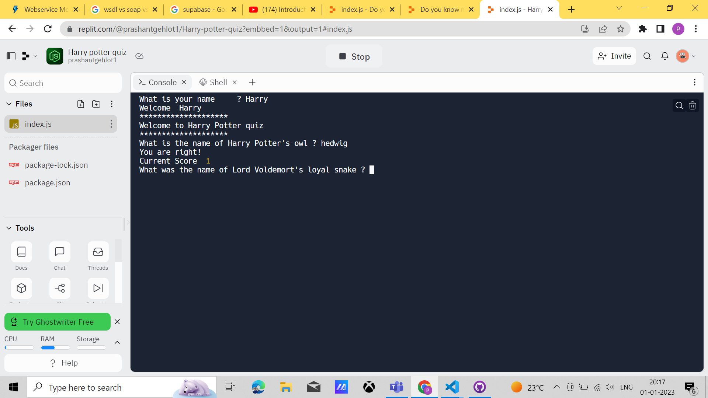

# Welcome to Fandom quiz app

This is cli based application where the user needs to provide his name first.
Then he can provide answer as input based on question asked.

It is CLI based application developed using vanilla javascript.

## Tech stack
1. Javascript

## Hosting URL : 
1. https://replit.com/@prashantgehlot1/Harry-potter-quiz?embbed=1&output=1

## Screenshots
 

## Future Roadmap

1. Soon i will update about the features and enhancement of application.

## About Author
Hi I am Prashant Gehlot

